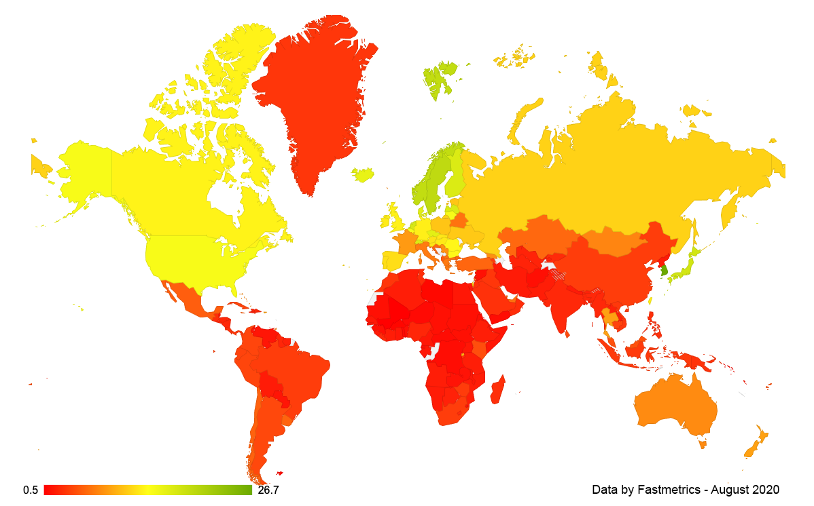
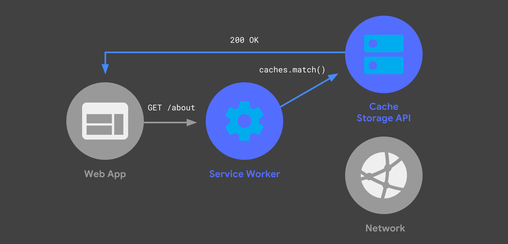
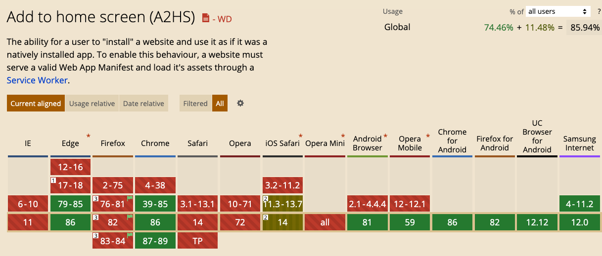
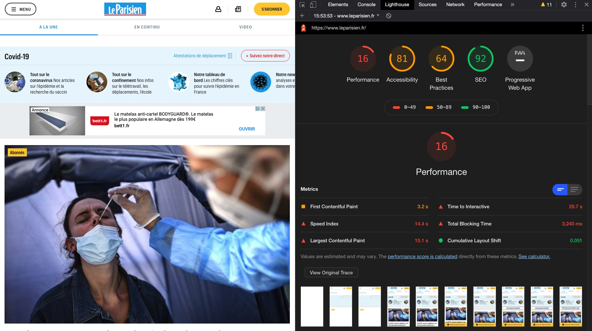
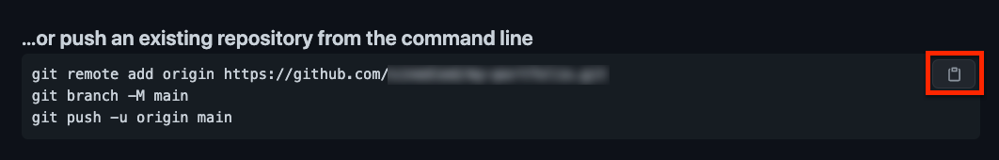

class: show-number, alt-code
layout: true

.bottom-bar[
  .light-text[Build, deploy and audit a serverless PWA | [aka.ms/spwa](https://aka.ms/spwa)] .float-right[@sinedied & @olivierleplus]
]

---

class: left, no-bar, primary, no-counter

.title[
# .light-text[Build, deploy and audit a serverless]
# .light-text[PWA with Azure Static Web Apps]

.space[## SimpleWebConf 2021 // Workshop]

.center[]
]

.full-layer.who.text-right.small.middle.light-text[
  .ms.responsive[]
  |
  Yohan Lasorsa
  |
  Olivier Leplus
]

---

# Workshop Objectives
- Create an Angular SPA and turn it into a PWA
- Configure service worker to add offline support
- Audit your app with Lighthouse 
- Deploy your app on Azure Static Web Apps
- Learn how build you very own PWA 😎

**Slides**<br>.big.up.ib[[aka.ms/spwa](https://aka.ms/spwa)]

---

# Prerequisites .float-right.small[[aka.ms/spwa-pre](https://aka.ms/spwa-pre)]

| | |
|---------------|-----------------|
| Node.js v12.15+ | https://nodejs.org |
| Git | https://git-scm.com |
| GitHub account | https://github.com/join |
| Azure account | https://aka.ms/student/azure |
| A code editor | https://aka.ms/get-vscode |
| A chromium-based browser | https://www.microsoft.com/edge |

---

# Who are we?

.table.row.middle.center[
.col-2[]
.col-4.center[
  .w-70.responsive.avatar.bounceInLeft.animated[]

  **Yohan Lasorsa**<br>
  .fab.fa-twitter[] .e[@sinedied]
]
.col-4.center[
  .w-70.responsive.avatar.bounceInUp.animated[]

  **Olivier Leplus**<br>
  .fab.fa-twitter[] .e[@olivierleplus]
]
]

---

class: middle
# .baseline.large[Who are .alt-text[**you**]? 🙂]

---

class: center, middle

# Making apps
<div style="height: 1em"></div>

???
What means do we have to make apps today?

--
.w-20.responsive.top.margin-right[
  ### Web
  
]
--
.w-20.responsive.top.margin-right[
  ### Native
  
]
--
.w-20.responsive.top[
  ### Hybrid
  <div style="height: 1em"></div>
  .w-30.responsive[]
  .w-30.responsive[]
  .w-30.responsive[]
  <br>
  .w-30.responsive[]
  .w-30.responsive[]
  .w-30.responsive[]
]

???

Usually the tech is chosen depending on multiple factors.

--

### .alt-text.large[Cost vs Performance vs Reach]
--
.alt-text.large[ ?]
---

class: alt, middle, impact

## .large[Who **can** use your app?]
???

Qui peut utiliser votre app?

- platform restrictions
- device performance
- network performance

- You have performance tests
- You have identified persona
- You have analytics

---

# Survivor bias
## You may be missing something

.responsive[]

???
Your data may not tell the whole story, and your interpretation of it may biased.

In particular, it's easy to not account for the survivor bias.
Let me illustrate this:

- On this plane, the red dots shows where the US planes where gunned during WW2.
- As a result, the military wanted to add armor in these locations.
- Statistic research group looked at the same data and said that parts where plane were not gunned according to the data should be reinforced.
- Because the data was only from returning planes: they could have sustained the damagae and get back home.

It can be the same with your users!

That may seem a bit of a strech, but the way today to be sure your app can be used by everyone is to make a PWA, and we'll see why!

---

class: impact
# .small[What's a .animated.jackInTheBox.ib.alt-text[**PWA**]?]

???
First let's start with some definition.

---

class:  center, middle, big-text

# 🙅‍♂️<br>It's **not**

--
A framework<br>
--
A new technology

---

class: middle

# It's "just" a web app

--
.full-layer.right.space-right[
<div style="height: 5em"></div>
.w-50.responsive.rounded.space-left[]
]

???

Don't leave yet!

--
### With a better user experience

???

It's a web app that aims to provide a top notch user experience, by following some best practices, using the best of what the web can do today.

---
class: middle

# Definition
<br>

.quote[
> .span[Progressive Web Apps are user experiences] .span[that have the reach of the web, and are fast, reliable and engaging]
]

---
class: middle

# Definition
<br>

.quote[
> .span[Progressive Web Apps are] .alt-text[user experiences] .span[that have the reach of the web, and are fast, reliable and engaging]
]

---

class: dark, middle, center, big-text

# .middle[The 3 principles of]

.w-20.responsive[]

---

class: middle, split-slide
## .large[Fast]

.split.w-70.primary.middle.full[
  .bg.overlay[
    
  ]

.large[53% of users lost if app loading > 3s<br><br>]
<!-- .margin-top.no-margin[
  *FCP, TTI, caching, smooth scrolling, response time...*
] -->
]

???

FCP, TTI, caching, smooth scrolling, response time...

---

class: middle, split-slide
## .large[Reliable]

.split.w-70.primary.middle.full[
  .bg.overlay[
    
  ]

.large[Always work, start quickly<br><br>]
<!-- .margin-top.no-margin[
  *Offline support, service worker, Web Storage, IndexedDB...*
] -->
]

???

Offline support, service worker, Web Storage, IndexedDB...

---

class: middle, split-slide
## .large[Engaging]

.split.w-70.primary.middle.full[
  .bg.overlay[
    
  ]

.large[Feels like a native experience<br><br>]
<!-- .margin-top.no-margin[
  *Full screen, Notifications, Home screen shortcut, native features...*
] -->
]

???

Full screen, Notifications, Home screen shortcut, native features...

---

exclude: true
background-image: url(images/why.gif)
class: dark, contain

---

class: center
# .sketch.large[Benefits for users]

.col-6.float-left[
.col-5.responsive[]

.large[Twitter Native App]

.big[**131 MB**]
]
.col-6.col-6.float-left[
.col-5.responsive[]

.large[Twitter Lite PWA]

.big[**2.2MB**]
]

???

- Small size
- Load faster
- No gating (App Store)
- Better usage of bandwidth
- Lighter on battery
- Fast updates

---

class: center
### Average internet speed by country

.no-margin.up[
.w-80.responsive[]
]

???

- Not everyone have 4G, let even 3G
- Map in Mbps

---

class: center, full, cover, overlay-dark, no-bullet
background-image: url(images/money.jpg)


# .sketch.large[Benefits for developers]

.big-text[
- Cost efficiency
- Freedom to deploy and update
- Shorter time to market
- Seamless onboarding
- Higher conversion rates

.w-40.responsive[[](https://www.pwastats.com/)]
]

???
- Portable, reuse standard tech
- Who needs Apple approval?

---

class: middle, split-slide, impact, left, alt
# How?

.split.w-50.primary.middle.full[
  .bg.width[
    
  ]
]

---
class: no-bullet, big-text, center, clist

# .sketch[PWA Checklist]

- ✅ HTTPS
- ✅ Responsive Web Design
- ✅ Offline (ie Service Worker)
- ✅ Web App Manifest
- ✅ TTI < 10s on 3G
- ✅ Cross-{browser, device}

---
class: no-bullet, big-text, center, clist

# .sketch[PWA .small[.small[(minimal)]] Checklist]

- ✅ HTTPS
- ✅ Responsive Web Design
- ✅ Offline (ie Service Worker)
- ✅ Web App Manifest
- ✅ TTI < 10s on 3G
- ✅ Cross-{browser, device}

---

class: big-text, center, dark, hide-handle
.head.dark[
# .fit[] Service Worker
]
<br><br>
.w-80.responsive[]
.fade.small.light-text[[developers.google.com/web/updates/2018/05/beyond-spa](https://developers.google.com/web/updates/2018/05/beyond-spa)]
---

class: big-text, center, dark, hide-handle
.head.dark[
# .fit[] Service Worker
]
<br><br>
.w-80.responsive[]
.fade.small.light-text[[developers.google.com/web/updates/2018/05/beyond-spa](https://developers.google.com/web/updates/2018/05/beyond-spa)]

---

class: big-text, hide-handle
.head.dark[
# .fit[] Service Worker
]
.head-spacer[
]

## Libraries

- WorkBox
- @angular/service-worker
- UpUp
- offline-plugin for Webpack

.full-layer.right.space-right.through[
  <div style="height: 3em"></div>
  .w-40.responsive.rounded[]
]

---
class: big-text, middle, center, hide-handle
.head.dark.baseline[
# .fit[] .light-text[[serviceworke.rs](https://serviceworke.rs)] - .alt-text[The cookbook]
]
<br>
.responsive[]

---

class: big-text, center, middle
.head.dark.baseline[
# .fit[] Service Worker - .alt-text[Can I use it?]
]
.head-spacer[]

.responsive[]

.small[[jakearchibald.github.io/isserviceworkerready/](https://jakearchibald.github.io/isserviceworkerready/)]

---

.head.dark[
# .fit[] Web App Manifest
]
<br><br><br>
.no-margin[
```html
<link rel="manifest" href="manifest.webmanifest"/>
```
]
--
.no-margin[
```json
{
  "name": "My Awesome PWA",
  "short_name": "My PWA",
  "theme_color": "#488aff",
  "background_color": "#488aff",
  "start_url": "/",
  "display": "standalone",
  "icons": [
    {
      "src": "assets/icon@512.png",
      "sizes": "512x512",
      "type": "image/png"
    },
    ...
  ]
}
```
]

---

class: center, hide-handle
.head.dark[
# .fit[] Web App Manifest - .alt-text[Can I use it?]
]
<br><br><br>

.responsive[]
.no-margin[
  [caniuse.com/web-app-manifest](https://caniuse.com/web-app-manifest)
]

---

class: center
.head.dark[
# .fit[] TTI < 10s on 3G
]
<div style="height: 4em"></div>

???
One goal
--
# .alt-text[🏎️ **GO FAST!** 🏎️]

.w-40.responsive.rounded[]

---

class: center
.head.dark[
# .fit[] TTI < 10s on 3G
]
.head-spacer[]

# Lighthouse

.w-50.responsive[]

---

class: center, hide-handle
.head.dark[
# .fit[] TTI < 10s on 3G
]
<div style="height: 3em"></div>
.w-90.responsive[]

???
- Chrome audit tab
- Also NPM package for CI

---

class: middle
# Time to practice!

---

class: impact, left
# #1
## Bootstrap app, setup repo & deploy

---

# Test your setup

Open a terminal and type:

```sh
node --version
git --version
```

---

# Create Angular app

```sh
# Install Angular CLI
npm install -g @angular/cli@latest

# Create Angular app
ng new my-pwa --defaults
cd my-pwa

# Test it
ng serve --open
```

<!--
# Build for production

Edit `package.json` and change build script to:
```json
"build": "ng build --prod",
```

Commit changes:
```sh
git add . && git commit -m "build for prod"
```
-->

---

# Push to GitHub

1. Create new repo: https://github.com/new

  .do[
  > **Tip**: With GitHub CLI (https://cli.github.com) you can do it directly from command line: `gh repo create <name> --public`
  ]

2. Push your code to the repo, by copy/pasting the commands shown on GitHub:

  

---

# Azure Static Web Apps .float-right.small[[aka.ms/docs/swa](https://aka.ms/docs/swa)]

## What's SWA?

.quote[
> It's an all-inclusive **hosting service** for web apps with **serverless APIs**, based on a continuous integration and deployment pipeline from a GitHub or Azure DevOps repository.
]

**Provides**:<br>
CI/CD, assets hosting, APIs, SSL certificate, route control, authentication, authorization, CDN, staging environments...

---

# Deploy to Azure Static Web Apps

1. Open Azure portal: [aka.ms/create/swa](https://aka.ms/create/swa)

2. Create new resource group `my-pwa`

3. Enter a name and choose a region

4. Sign in to GitHub and select your GitHub repo and `main` branch

5. In **Build Details**, choose the `Angular` build preset

6. Click **Review + create**, then **Create**

---

# The deployment workflow

In the Azure portal, in the created resource, select **GitHub Actions runs**.

> You can see the **C**ontinous **I**ntegration (CI) and **C**ontinuous **D**eployment (CD) jobs running.

## How the process works?

- Azure made a new commit in your repo with `.github/workflows/<name>.yml`
- The workflow is built with [GitHub Actions](https://github.com/features/actions)
- Every **new commit** triggers a new build and deployment
- You can preview changes separately using a **pull request**

---

class: impact, left
# #2
## Audit, update to PWA, offline

---

# Audit your app

1. Open your deployed website URL

2. Open DevTools with `F12` or `OPTION+COMMAND+I` (Mac)

3. Navigate to **Lighthouse** tab

4. Click on **Generate report**

---

# Update to PWA

```sh
# Make your app a PWA
ng add @angular/pwa

# See the changes
git diff
```

.do[
> **Note**: there is no `ngsw-worker.js` file, it will be automatically generated during build based on `ngsw-config.json`.
]

.do[
> **Note**: if you're not using Angular, [WorkBox](https://developers.google.com/web/tools/workbox) is an alternative service worker library that works with any website.
]

---

# Test offline

Commit and push your changes:
```sh
git add . && git commit -m "add PWA support" && git push
```

### Once your new version is deployed

- Open your web app again then **generate an audit report again**.

- Take a look at **Application** tab.

- Go to **Network** tab, switch from `online` to `offline` and refresh.

---

class: impact, left
# #3
## Add API, update SW config, home install

---

# Add API

The API is based on Azure Functions: [aka.ms/go/functions](https://aka.ms/go/functions)

```sh
# Create API folder
mkdir api && cd api

# Create functions config file
echo "{ \"version\": \"2.0\" }" > host.json

# Create function folder
mkdir hello && cd hello
```

.do[
> **Tip**: if you install Azure Functions Core Tools ([aka.ms/tools/func](https://aka.ms/tools/func)) you can just use `func init` instead. You can also test your functions locally with `func start`.
]

---

# Create function

.w-50.float-left.no-margin[
Create a file `index.js` with this:

```js
async function GetHello(context, req) {
  context.res = {
    body: 'Hello from API!'
  };
};

module.exports = GetHello;
```
]
.w-50.float-left.no-margin.space-left[
Create a file `function.json` with this:
```json
{
  "bindings": [
    {
      "authLevel": "function",
      "type": "httpTrigger",
      "direction": "in",
      "name": "req",
      "methods": ["get"]
    },
    {
      "type": "http",
      "direction": "out",
      "name": "res"
    }
  ]
}
```
]

---

# Use API in Angular app (1/2)

Edit `src/app/app.component.ts`:
```ts
import { HttpClient } from '@angular/common/http';

...

export class AppComponent {
  hello$ = this.httpClient.get('api/hello', { responseType: 'text' });

  constructor(private httpClient: HttpClient) {}
}
```

Edit `src/app/app.component.html`:
```ts
Message: {{ hello$ | async }}
```

---

# Use API in Angular app (2/2)

Edit `src/app/app.module.ts`:
```ts
*import { HttpClientModule } from '@angular/common/http';

...

  imports: [
    BrowserModule,
    ServiceWorkerModule.register('ngsw-worker.js', { enabled: environment.production }),
*   HttpClientModule
  ],
```

---

# Deploy and test API

Commit and push your changes:
```sh
git add . && git commit -m "add API" && git push
```

### Once your new version is deployed

- Open your web app again and hit `shift` + refresh (don't forget to switch back to `online` first!).

- Go to **Network** tab, switch from `online` to `offline` and refresh.

.big[😱]

---

# Update service worker config

Edit `ngsw-config.json`: .float-right[**docs:** https://angular.io/guide/service-worker-config]
```json
{
  ...
  "dataGroups": [
    {
      "name": "api",
      "urls": ["/api/hello"],
      "cacheConfig": {
        "maxSize": 1,
        "maxAge": "1m",
        "strategy": "freshness"
      }
    }
  ]
}
```

---

# Deploy and test API (again)

Commit and push your changes:
```sh
git add . && git commit -m "update SW config" && git push
```

### Once your new version is deployed

- Open your web app again and hit `shift` + refresh (don't forget to switch back to `online` first!).

- Go to **Network** tab, switch from `online` to `offline` and refresh.

.big[😎]

---

# Home screen install

Open your app on your mobile phone.

## Android

Refresh a few times to see the install banner, or tap menu and choose **Add to home screen**.

.do[
> **Tip**: you can customize install UI using `beforeinstallprompt` event, see https://web.dev/customize-install
]

## iOS

Tap the share button and choose **Add to home screen**.

---

class: impact, left
# #4
## [Bonus] App updates, your own PWA

---

# Using `SwUpdate` service
**Docs:** https://angular.io/guide/service-worker-communications

- Get notified of available updates
- Get notified of update activation
- Check for updates
- Activate latest updates

---

# Add update button (1/2)

Edit `src/app/app.component.ts`:
```ts
*import { SwUpdate } from '@angular/service-worker';
...

export class AppComponent {
  ...
* updateAvailable$ = this.swUpdate.available;

  constructor(private httpClient: HttpClient,
*             private swUpdate: SwUpdate) {}

*  async update() {
*    await this.swUpdate.activateUpdate();
*    document.location.reload();
*  }
}
```

---

# Add update button (2/2)

Edit `src/app/app.component.html`:
```ts
Message: {{ hello$ | async }}

<p *ngIf="updateAvailable$ | async; else noUpdate">
  An update is available!
  Click here to apply:
  <button (click)="update()">Update</button>
</p>
<ng-template #noUpdate>
  <p>No update available.</p>
</ng-template>
```

---

# Commit and redeploy

Commit and push your changes:
```sh
git add . && git commit -m "add SW updates" && git push
```

### Once your new version is deployed

- Open your web app again and hit `shift` + refresh.

- Check that you see the message `No update available.`, meaning that your app is up-to-date.

---

# Create a new version

- Add `<h1>New version!</h1>` to the top of `src/app/app.component.html`.

- Commit, push and wait for the new version to be deployed:
```sh
git add . && git commit -m "minor update" && git push
```

### Once your new version is deployed

- Hit refresh **ONCE** and **WITHOUT** holding shift.<br>You should see the **Update** button after a while.

- Click **Update**, the new version should appear.

---

# Make your own PWA 😎

### Public APIs .small[(or make your own!)]
- https://github.com/public-apis/public-apis
- https://apilist.fun

### Ngx Rocket generator .small[(example app: [bit.ly/ngx-pwa](https://bit.ly/ngx-pwa))]
https://github.com/ngx-rocket/generator-ngx-rocket

- Responsive PWA starter with Material/Ionic, i18n and more

📢 **Tweet about it and mention us!** 📢<br>
`@sinedied @olivierleplus @msdevs_fr`

---
<br>
.center[
# .big[Thank you!]
]

# Resources
- Angular Service Worker: https://angular.io/guide/service-worker-intro
- Workbox: https://developers.google.com/web/tools/workbox
- Azure Static Web Apps: https://aka.ms/docs/swa
- Ngx Rocket: https://github.com/ngx-rocket/generator-ngx-rocket
- Web Capabilities (Project Fugu 🐡): https://web.dev/fugu-status/
